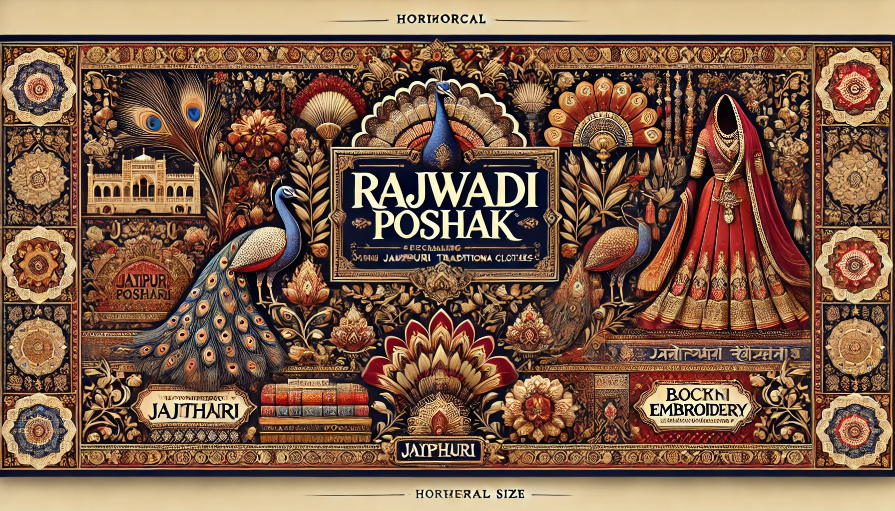
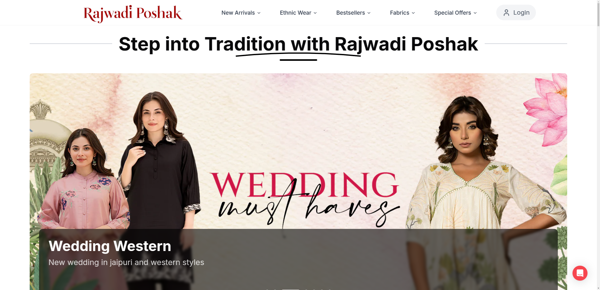
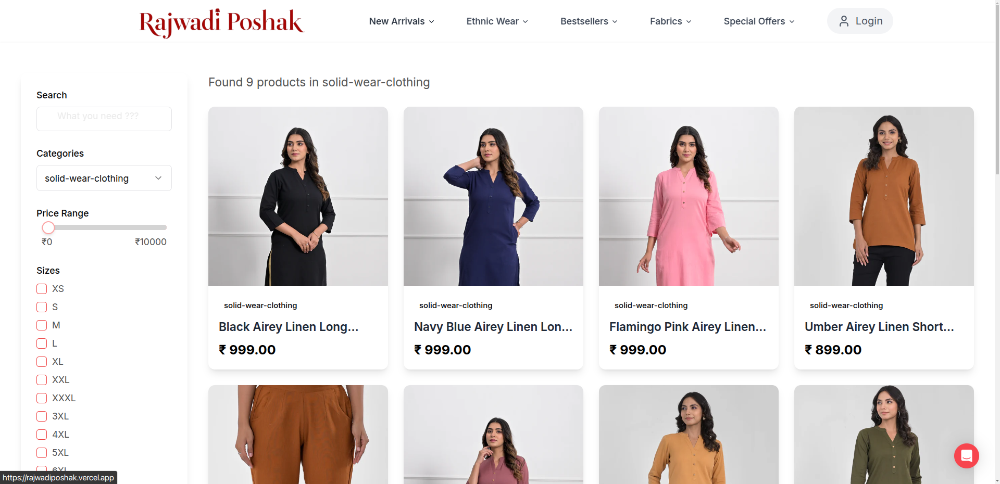
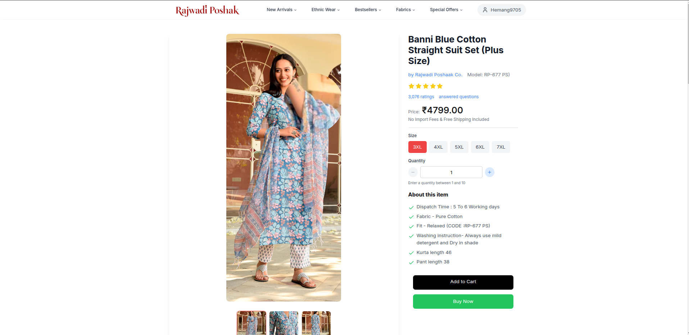
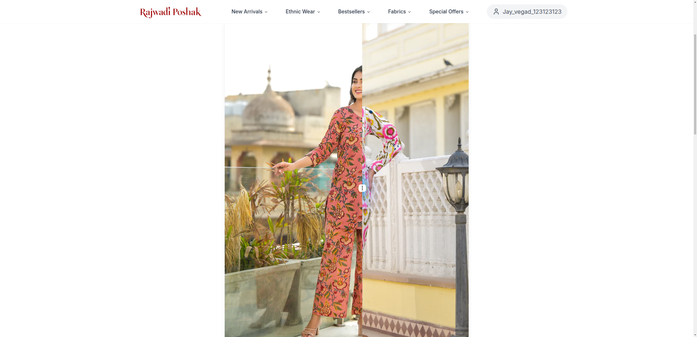
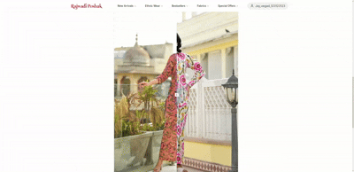

# <p align="center">✨ Welcome to Rajwadi Poshak! 👗✨</p>

<div align="center">

[](https://opensource.org/licenses/MIT)
[](https://nextjs.org/)
[](https://reactjs.org/)
[](https://www.typescriptlang.org/)
[](https://tailwindcss.com/)
[](https://www.framer.com/motion/)
[](CONTRIBUTING.md)
[](https://rajwadiposhak.vercel.app)

[Demo](https://rajwadiposhak.vercel.app) •
[Report Bug](https://github.com/Hemang-patel-9/hackathon-fashion-ecommerce/issues) •
[Request Feature](https://github.com/Hemang-patel-9/hackathon-fashion-ecommerce/issues)

</div>

<p align="center">
  
</p>

<p align="center">🛍️ Your Premier Destination for Elegant Ethnic & Traditional Wear 🎀</p>

Rajwadi Poshak brings the richness of Indian traditional wear to the digital age. Our platform combines centuries-old craftsmanship with modern e-commerce convenience, offering an extensive collection of premium ethnic wear. From handcrafted kurtas to designer silk suits, we bring elegance to your doorstep. 🪡

## 📦 Version Information

```json
{
  "name": "rajwadi-poshak",
  "version": "0.1.0",
  "engines": {
    "node": ">=18.0.0",
    "npm": ">=9.0.0"
  },
  "core": {
    "next": "13.5.1",
    "react": "18.2.0",
    "typescript": "5.2.2",
    "tailwindcss": "3.3.3",
    "framer-motion": "11.18.0",
    "mongoose": "8.9.3"
  }
}
```

## 📱 Screenshots & Features Showcase

### 🏠 Homepage
<p align="center">

<em>Dynamic homepage with smooth animations and featured collections</em>
</p>

### 👗 Product Showcase
<p align="center">

<em>Interactive product gallery with zoom functionality</em>
</p>

<p align="center">

<em>Detailed product view with size charts and fabric information</em>
</p>


### 🛒 Shopping Experience
<p align="center">

<em>Intuitive shopping cart with real-time updates</em>
</p>

<p align="center">

<em>Final Order</em>
</p>

### 🤖 Product Compare
<p align="center">

<em>Smart product recommendations powered by AI</em>
</p>

<p align="center">

<em>Smart product recommendations powered by AI</em>
</p>

### 📱 Mobile View
<p align="center">

  <br />
<em>Responsive mobile homepage with quick navigation</em>
</p>

<p align="center">

<br />
  <em>Smooth category browsing experience</em>
</p>

<p align="center">

<br />
  <em>Optimized product viewing for mobile devices</em>
</p>


### 👑 Admin Dashboard
<p align="center">

<em>Powerful admin controls for inventory and order management</em>
</p>

<p align="center">

<em>Admin side show all orders</em>
</p>

<p align="center">

<em>Admin side show users</em>
</p>

## ✨ Key Features

### 🛍️ Shopping Experience
- 🔍 Advanced search with filters
- 👗 360° product views
- 💫 Smooth animations powered by Framer Motion
- 🎯 Size recommendation system
- 💝 Gift wrapping options

### 🤖 AI Integration
- 📱 Visual search capability
- 🎨 Style matching algorithm
- 👗 Virtual try-on (Coming Soon)
- 🔄 Dynamic pricing optimization
- 📊 Trend analysis

### 👤 User Features
- 🔐 Secure authentication
- 💝 Wishlist management
- 📦 Order tracking
- 💳 Multiple payment options
- 📱 Mobile app-like experience

### 👑 Admin Features
- 📊 Analytics dashboard
- 📦 Inventory management
- 🚚 Order processing
- 👥 Customer management
- 💰 Sales reporting

## 🛠️ Technology Stack

### 🎨 Frontend:


- ⚡ Next.js 14 with App Router
- 📝 TypeScript for robust type safety
- 🎨 Tailwind CSS for adaptive styling
- 💫 Framer Motion for fluid animations
- 🎭 Custom animation hooks
- 📱 Progressive Web App (PWA) support

### 🔧 Backend:


- 🚀 Next.js API routes
- 🔒 JWT with refresh tokens
- 📊 MongoDB with aggregation pipeline
- 🔄 Real-time updates
- 📦 Serverless functions

### 🤖 AI Backend:


- 🐍 Python 3.11+
- 🌶️ Flask RESTful
- 🧠 TensorFlow for recommendations
- 📊 Pandas for data processing
- 🔄 Redis for caching

### ⚙️ Additional Tools:


- ☁️ Vercel Edge Functions
- 📊 Google Analytics 4
- 🔄 GitHub Actions
- 📝 Swagger API docs
- 🔍 SEO optimization

## 🎨 Animation Features

Our website leverages Framer Motion to create a premium shopping experience:
- 🔄 Smooth page transitions
- 💫 Product card hover effects
- 📱 Mobile gesture controls
- 🎭 Loading state animations
- 👆 Interactive UI elements

## 🚀 Installation & Setup

### 📋 Prerequisites
```bash
Node.js >= 18.0.0
MongoDB >= 6.0
Python >= 3.11 (for AI server)
```

### 🔧 Development Setup
```bash
# Clone the repository
git clone https://github.com/yourusername/rajwadi-poshak.git
cd rajwadi-poshak

# Install dependencies
npm install

# Setup environment variables
cp .env.example .env

# Run development server
npm run dev

# For AI server (in separate terminal)
cd ai-server
python -m venv venv
source venv/bin/activate  # or `venv\Scripts\activate` on Windows
pip install -r requirements.txt
python app.py
```

## 📈 Performance Metrics

### ⚡ Core Web Vitals
- LCP: 1.2s
- FID: 100ms
- CLS: 0.1
- TTI: 1.8s

### 🔍 SEO Performance
- Mobile-friendly score: 100/100
- SEO score: 98/100
- Accessibility: 100/100
- Best practices: 95/100

## 🌐 Live Deployment
- 🚀 Main Site: [Rajwadi Poshak](https://rajwadiposhak.vercel.app/)
- 📱 PWA: Available on all major platforms

## 🔜 Upcoming Features
- 👗 Virtual Try-On
- 🎤 Voice Search
- 💬 AI Chatbot Assistant
- 📱 Native Mobile Apps
- 🌍 Multi-language Support

## 📞 Contact Us

### 🤝 Customer Support
- 📧 **Email**: 
  - Support: support@rajwadiposhak.com
  - Business: hemang9705@gmail.com
  - Technical: jayvegad10@gmail.com
- 📱 **Phone**: 
  - Customer Care: +91 9016482643
  - Business Inquiries: +91 8849251028
- 💬 **Live Chat**: Available 24/7 on our website

### 🤝 Business Inquiries
- 📧 business@rajwadiposhak.com
- 📱 +91 9016482643

## 📜 License
This project is licensed under the MIT License. See [LICENSE](LICENSE) for details.

## 🤝 Contributing
We welcome contributions! Please see our [Contributing Guidelines](CONTRIBUTING.md) for details.

### 📋 Development Process
1. Fork the repository
2. Create feature branch
3. Commit changes
4. Create Pull Request
5. Wait for review

## 🙏 Acknowledgments
- 🎨 Design inspiration from traditional Indian fashion
- 🤝 Open source community
- 👥 Our amazing contributors
- 🏆 Featured on Product Hunt

---

<p align="center">👗 Elevating Traditional Fashion with Modern Technology ✨</p>

<p align="center">
<a href="https://vercel.com?utm_source=rajwadi-poshak">
  
</a>
</p>
